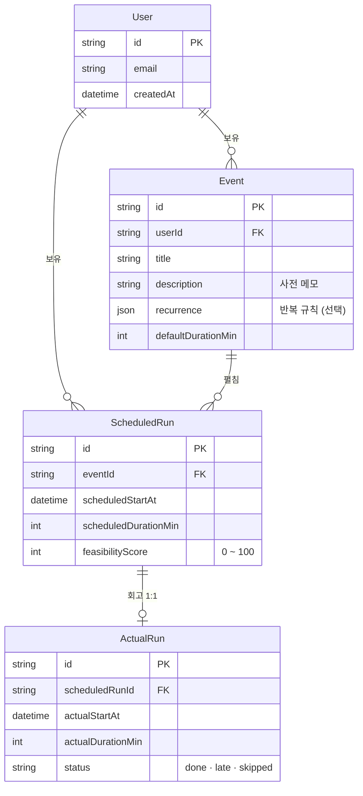

<div align="center">

# 📅 Prescient Calendar

**말 한 줄로 일정을 잡고, 지난 일을 돌아보고, "이거 진짜 할 수 있을까?" 를 내 기록을 보고 답해주는 AI 달력이에요.**

[](https://prescient-calendar.vercel.app)

> Google 계정으로 로그인한 뒤 우상단 **"테스트 데이터 추가"** 버튼을 누르면, 미리 만들어 둔 일정·회고가 한 번에 깔려서 바로 둘러볼 수 있어요.

[](https://github.com/foresty110/PrescientCalendar-/actions/workflows/ci.yml) [](https://nextjs.org/) [](https://www.typescriptlang.org/) [](https://www.prisma.io/) [](https://www.anthropic.com/)


</div>

---

## 📅 무엇을 하는 서비스인가

보통 달력 앱은 "잡혀 있는 일정을 표로 보여주는" 도구예요. 이 서비스는 그 위에 **대화로 다루는 세 가지 층**을 얹었어요.

1. **잡기** — "내일 3시에 운동 1시간", "매주 화 9시 회의" 처럼 한 줄만 말해도 시각·길이·반복 규칙까지 알아서 해석해서 달력에 넣어줘요.
2. **회고** — 지나간 일정을 채팅으로 가볍게 돌아봐요. "어제 운동 갔어, 25분 했어" 라고 말하면 완료/스킵/지연 상태와 실제 소요 시간이 자동으로 기록돼요.
3. **실현 가능성** — 새 일정 옆에 색 점이 떠요. 초록은 평소 잘 지키던 시간대, 노랑은 애매한 시간대, 빨강은 자주 못 지키던 패턴. 지난 회고 기록을 모아서 0~100 점으로 계산한 값을 보여줘요.

짧은 시나리오로 보면: "내일 3시에 30분 책 읽기" 라고 적으면 → 달력에 칩이 뜨고, 옆에 회색 점(아직 기록이 부족해 판단 보류) → 이틀 뒤 "어제 책 읽었어" 회고 → 점차 점수에 색이 입혀지기 시작해요.

---

## 📅 핵심 기능 4가지

각 기능마다 화면 한 장으로 빠르게 훑어볼 수 있어요.

### Google 로그인

Auth.js v5(Next.js 진영에서 많이 쓰는 인증 라이브러리) 위에 Google OAuth 와 DB 세션을 얹었어요. 로그인 안 한 사람이 보호 페이지로 들어가려 하면 미들웨어와 페이지 양쪽에서 두 번 막아요(이중 가드라고 부르는 패턴).


### 대화형 일정 잡기

채팅에 한 줄을 적으면 Claude 가 "아, 이건 일정을 잡고 싶다는 거구나" 를 알아채고, 정해진 함수(시각·반복·길이를 추출하는 도구)를 직접 호출해서 DB 에 저장해요. "매주", "매일", "매월" 같은 반복 규칙은 4주 앞까지 자동으로 펼쳐서 미리 채워둬요.


### 대화형 회고

지나간 일정을 AI 가 한 번에 묶어서 보여주고, 사용자가 "운동만 다 했고 책 읽기는 못 했어" 같이 말하면 그 말을 상태와 시간 정보로 풀어서 일괄로 기록해요. 잘못 기록되지 않게 확정 전에 한 번 더 물어보는 규칙은 AI 에게 처음에 알려주는 안내문에 박아 뒀어요.


### 실현 가능성 예측

새 일정을 만들 때 점수가 자동으로 계산돼서 달력에 색 점으로 나타나요. 시간대·요일·키워드를 기준으로 지난 실행률을 가중 평균해서 매겨요. 데이터가 5건도 안 쌓였거나 가입한 지 14일이 안 됐으면 회색으로 두는데, 표본이 적을 때 성급한 판단을 보여주지 않으려는 거예요.


전체 기능 목록은 [`FEATURES.md`](FEATURES.md) 에 정리해 뒀어요.

---

## 📅 의사결정 과정과 고민

코드만 봐서는 안 보이는 결정들이 있어요. "왜 이 길을 골랐고, 어떤 걸 포기했는지" 를 따로 적어 뒀어요. 결과보다 그 사이의 고민이 더 잘 드러나는 자료라고 생각해서요.

- [**다음 주 예측 기능은 MVP 에서 뺐어요**](docs/decisions/2026-05-13-exclude-next-week-prediction.md) — 흥미롭지만 정확도가 안 받쳐주면 오히려 신뢰를 깎는다고 봤어요.
- [**모바일 반응형은 일단 미뤘어요**](docs/decisions/2026-05-13-defer-mobile-responsive.md) — 데스크탑 한 화면을 먼저 단단히 만드는 데 집중.
- [**pnpm 의 빌드 스크립트 자동 실행을 막았어요**](docs/decisions/2026-05-14-pnpm-frozen-lockfile-ignore-scripts.md) — 의존성 설치 중에 의도치 않은 코드가 실행되는 걸 차단.
- [**실현 가능성 점수 계산식을 v2 로 갈았어요**](docs/decisions/2026-05-15-feasibility-formula-v2.md) — 가중 합 + 신뢰도 5단계 + 영향 요인 분해까지.
- [**시간 충돌은 거절 + 대안 제시 쪽으로**](docs/decisions/2026-05-15-conflict-reject-with-alternatives.md) — 그냥 잡아주지 않고 사용자에게 작은 카드로 대안을 보여줘요.
- [**미리보기 배포 주소를 항상 같게 만들었어요**](docs/decisions/2026-05-20-fixed-vercel-preview-alias.md) — PR 마다 URL 이 바뀌어서 공유가 불편하던 걸 한 줄 별칭으로 해결.

전체 결정 목록은 [`docs/decisions/`](docs/decisions/README.md) 에 있어요.

---

## 📅 트러블슈팅 기록

작업하다 막혔던 문제들을 그때그때 정리해 뒀어요. 30 분 이상 잡아먹은 디버깅이나, 표면 증상과 실제 원인이 다르던 케이스 위주로요.

- [**CI 에서 pnpm 이 빌드 스크립트를 조용히 건너뛰었어요**](docs/troubleshooting/2026-05-12-ci-pnpm-frozen-lockfile-ignored-builds.md) — 로컬에선 잘 되는데 CI 만 빨강이던 문제.
- [**Edge 미들웨어에서 DB 세션을 못 읽었어요**](docs/troubleshooting/2026-05-12-edge-middleware-db-session-jwe-error.md) — Auth.js v5 와 Edge 런타임 사이의 어긋남.
- [**Vercel 첫 배포에서 CLI 가 묘하게 동작했어요**](docs/troubleshooting/2026-05-14-vercel-first-deploy-cli-quirks.md) — 처음 배포한 사람만 만나는 함정 모음.
- [**prod 의 Google 로그인이 redirect_uri 불일치로 실패했어요**](docs/troubleshooting/2026-05-14-vercel-prod-oauth-redirect-uri-mismatch.md) — 배포 직후 OAuth 콜백 등록 누락.
- [**회고를 저장했는데 타임라인이 옛 값을 그대로 보였어요**](docs/troubleshooting/2026-05-19-retro-save-timeline-not-synced.md) — 한 화면 안에서 두 영역이 같은 데이터를 따로 들고 있던 게 원인.

전체 기록은 [`docs/troubleshooting/`](docs/troubleshooting/README.md) 에 있어요.

---

## 📅 데이터 모델 (ERD)

도메인의 핵심 모델 네 가지와 관계예요. 인증 관련 표(Auth.js 표준)는 빼고 그렸어요.



`Event` 가 "일정 템플릿(반복 규칙 포함)" 이고, `ScheduledRun` 이 그 템플릿에서 펼쳐진 "특정 시점 인스턴스" 예요. 인스턴스 단위로 회고(`ActualRun`)와 실현 가능성 점수가 1:1 로 매핑돼요. 자세한 도메인 설명은 [`docs/domain.md`](docs/domain.md) 에 있어요.

모든 도메인 데이터는 `userId` 를 외래키로 갖고, 모든 조회는 로그인된 사용자의 ID 로 한 번 더 걸러요. 다른 사용자의 ID 를 입력으로 받는 함수는 `assertOwnership()` 헬퍼로 한 번 더 차단해요(다른 사람 자료를 ID 만 바꿔서 들춰보는 부류의 공격을 막는 코드예요).

---

## 📅 기술 스택

| 영역 | 선택 |
|---|---|
| 프레임워크 | Next.js 16 (App Router), React 19, TypeScript strict |
| 스타일 | Tailwind CSS 4 |
| DB | Postgres + Prisma 5 |
| 인증 | Auth.js v5 (Google OAuth, DB session) |
| AI | Anthropic Claude API (도구 호출, 프롬프트 캐시) |
| 테스트 | Vitest (단위), Playwright (e2e) |
| 배포 | Vercel + Neon (서버리스 Postgres) |
| API 문서 | OpenAPI 3.1 자동 생성 + Scalar 뷰어 (`/api/docs`, 공개) |

---

## 📅 로컬 실행

먼저 준비할 것: Node.js 22.13+, pnpm 11, Docker (Postgres 컨테이너용).

```bash
pnpm install --ignore-scripts        # pnpm 11 의 strict 정책을 우회 (관련 결정 문서는 docs/decisions/2026-05-14-pnpm-frozen-lockfile-ignore-scripts.md)
pnpm prisma generate                 # Prisma 클라이언트 코드 생성
docker compose up -d                 # Postgres 컨테이너 띄우기
cp .env.example .env                 # 환경 변수 채우기 (DATABASE_URL, ANTHROPIC_API_KEY, AUTH_GOOGLE_ID/SECRET 등)
pnpm db:migrate                      # DB 스키마 적용
pnpm dev                             # http://localhost:3000
```

자주 쓰는 명령:

```bash
pnpm typecheck    # tsc --noEmit
pnpm lint         # eslint
pnpm test         # vitest 단위 테스트
pnpm test:e2e     # playwright e2e (인증을 코드로 주입하는 방식)
pnpm sanity       # AI 호출 sanity check (Anthropic API 비용이 약간 발생)
pnpm openapi:gen  # Zod 스키마에서 openapi.json 재생성
```

---

## 📅 배포

Vercel + Neon (서버리스 Postgres) + Google OAuth prod 콜백으로 굴려요.

`main` 브랜치에 합쳐지면 자동으로 prod 배포가 돌아요. 그 외 브랜치는 PR 마다 미리보기 배포가 자동으로 만들어져요. 그리고 PR 미리보기 URL 이 매번 바뀌는 게 불편해서, **고정 미리보기 주소** 하나(`https://prescient-calendar-preview.vercel.app`) 가 항상 최신 PR 을 가리키도록 자동화도 해 뒀어요(자세한 결정은 [고정 별칭 자동화](docs/decisions/2026-05-20-fixed-vercel-preview-alias.md)).

환경 변수는 Production · Preview · Development 세 슬롯에 같은 키를 각각 등록해야 해요. 한 곳만 비어도 그 환경의 빌드가 실패해요. 전체 배포 절차는 [`docs/deploy.md`](docs/deploy.md) 에 정리해 뒀어요.

<div align="center">

[](https://prescient-calendar.vercel.app)

</div>

---

## 📅 라이선스

포트폴리오 목적으로 공개한 저장소예요. 별도 라이선스가 명시되기 전까지 코드 재사용은 저자에게 한 번 문의 부탁드려요.
