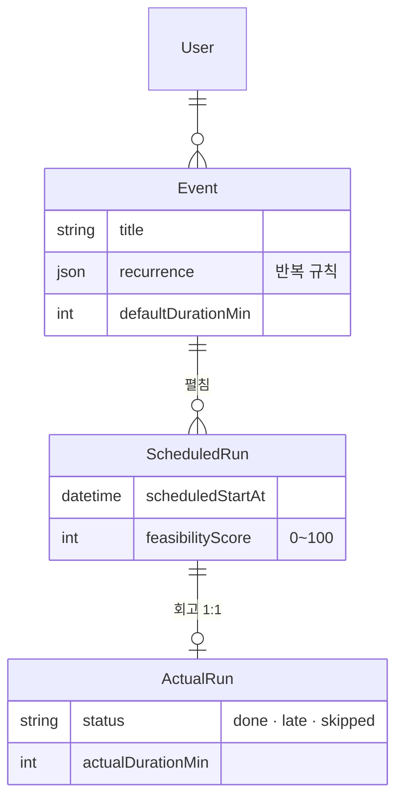

<div align="center">

# Prescient Calendar

"내일 3시에 운동"이라고 치면 일정이 잡히고, "어제 운동 30분 했어"라고 치면 회고가 된다. 기록이 쌓이면 새 일정 옆에 "내가 이 시간대에 보통 지키는 편인지" 점수가 붙는다.

[](https://github.com/foresty110/PrescientCalendar-/actions/workflows/ci.yml) [](https://www.typescriptlang.org/)

**[배포 운영중](https://prescient-calendar.vercel.app)** (Google 계정으로 로그인)

> 로그인 후 우상단 **"테스트 데이터 추가"** 버튼을 누르면 샘플 일정 데이터를 추가해서 기능을 바로 사용해볼 수 있습니다.


</div>

---

## 만든 이유

캘린더 앱을 여러 개 써봤는데 공통적인 문제가 있었다. 일정을 잡는 건 쉬운데 지나고 나면 기록이 남질 않는다. 그러니까 내가 비슷한 상황에서 그 일정을 잘 지키는 편인지, 그 시간대가 나한테 현실적인지를 알 방법이 없다. LLM이 자연어를 이해한다면, 일정 잡는 것도 돌아보는 것도 말로 할 수 있겠다 싶어서 만들기 시작했다.

## 기능

**일정 잡기** — "매주 화 9시 회의"처럼 채팅 한 줄을 보내면 반복 규칙까지 파악해서 4주치를 캘린더에 미리 깔아준다. 날짜 계산이나 반복 펼치기 같은 걸 직접 구현하면서 생각보다 엣지 케이스가 많다는 걸 알게 됐다.

**대화형 회고** — "운동은 했는데 독서는 패스"라고 말하면 각각 완료·스킵으로 나눠서 기록해준다. 잘못 기록되는 걸 막으려고 확정 전에 반드시 한 번 더 확인하는 규칙을 시스템 프롬프트로 강제했다.

**실현 가능성 점수** — 새 일정을 만들면 비슷한 시간대·요일의 과거 완료율을 합산해 0~100점이 자동으로 붙는다. 처음에 점수가 너무 성급하게 나와서, 데이터가 5건 미만이거나 가입 14일 이내면 회색으로 두는 조건을 따로 달았다.

## 데이터 모델



처음엔 `Event` 하나로 다 하려 했는데, 반복 일정의 특정 회차만 회고하려면 인스턴스 개념이 따로 필요하다는 걸 깨달았다. 그래서 `Event`(반복 규칙 포함 템플릿)와 `ScheduledRun`(특정 시점 인스턴스)으로 나눴고, 덕분에 "매주 화 회의" 중 특정 날만 스킵 처리하는 게 깔끔하게 됐다.

## 아키텍처

```
브라우저 (React)
│  Calendar · Chat · Timeline 컴포넌트
│
▼  POST /api/chat
Route Handler  ←  Auth.js 세션 검증
│
▼
agent.ts  —  멀티턴 tool_use 루프
│              Claude가 tool_use를 반환하면 실행 후 다시 호출,
│              text만 반환하면 종료
▼  tool_use
tools.ts  —  Zod 스키마 검증 + userId 소유권 확인
│
▼
src/lib/db/  —  Prisma 함수 (DB 접근은 여기서만)
│
▼
Postgres (Neon)
```

핵심은 `agent.ts`의 멀티턴 루프다. Claude가 도구를 호출하면 실행 결과를 다시 Claude에게 넘기고, 텍스트 응답만 돌아올 때까지 반복한다. 처음엔 단순할 것 같았는데 최대 턴 제한이나 도구 실행 실패 처리 같은 부분에서 생각보다 손이 많이 갔다.

## 스택

| 영역 | 기술 |
|---|---|
| 프레임워크 | Next.js 15 (App Router), TypeScript strict |
| 스타일 | Tailwind CSS 4 |
| DB | Postgres + Prisma 5 |
| 인증 | Auth.js v5, Google OAuth |
| LLM | Anthropic Claude (tool use, prompt caching) |
| 테스트 | Vitest, Playwright |
| 배포 | Vercel + Neon |

## 로컬 실행

```bash
pnpm install --ignore-scripts
cp .env.example .env    # ANTHROPIC_API_KEY, DATABASE_URL, AUTH_GOOGLE_ID/SECRET 필요
docker compose up -d
pnpm db:migrate
pnpm dev                # http://localhost:3000
```

## 설계 기록

작업하면서 했던 선택과 막혔던 지점을 따로 남겼다. 코드만 봐선 왜 이렇게 짰는지 모르는 것들이 꽤 있어서, 그 판단 과정을 기록해두는 게 맞다고 생각했다.

- [`docs/decisions/`](docs/decisions/README.md) — 두 가지 이상 접근 중 하나를 고른 이유와 트레이드오프
- [`docs/troubleshooting/`](docs/troubleshooting/README.md) — 증상과 원인이 달랐던 케이스들, 어디서 시간을 잡아먹었는지

---

포트폴리오 목적으로 공개한 저장소입니다. 코드 재사용 시 문의해 주세요.
