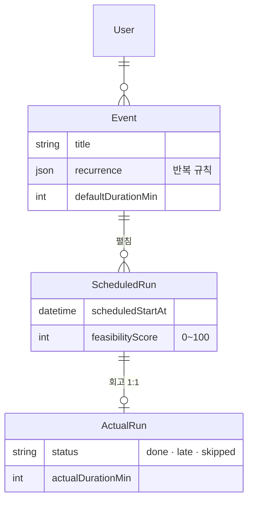

<div align="center">

# Prescient Calendar

과거 일정 실행 기록을 바탕으로, 새 일정의 실현 가능성을 0~100점으로 예측해주는 AI 캘린더.

[](https://github.com/foresty110/PrescientCalendar-/actions/workflows/ci.yml) [](https://www.typescriptlang.org/)

**[라이브 데모 →](https://prescient-calendar.vercel.app)** (Google 계정으로 로그인)

> 로그인 후 우상단 **"테스트 데이터 추가"** 버튼을 누르면 샘플 일정·회고가 깔려서 기능을 바로 둘러볼 수 있다.


</div>

---

## 해결하려는 문제

계획은 세우지만 자주 지키지 못하는 사람은, 자신이 무엇을 못 지키는지 객관적으로 보기 어렵다. 일반 캘린더는 일정을 기록할 뿐 "이 계획이 현실적인지"는 알려주지 않는다. 과거 실행 데이터로 새 계획의 실현 가능성을 미리 보여주면, 더 현실적인 계획을 세울 수 있다고 생각했다.

## 프로젝트 배경

기획부터 배포까지 혼자 완성한 개인 프로젝트다. LLM API를 연동해 자연어를 일정 데이터로 변환하고, AI가 의도에 맞게 동작하도록 지시·검증하는 에이전트 설계 방식을 직접 적용했다.

## 기능

**일정 잡기** — "매주 화 9시 회의"처럼 채팅 한 줄을 보내면 반복 규칙까지 파악해서 4주치를 캘린더에 미리 깔아준다. 날짜 계산이나 반복 펼치기 같은 걸 직접 구현하면서 생각보다 엣지 케이스가 많다는 걸 알게 됐다.

**대화형 회고** — "운동은 했는데 독서는 패스"라고 말하면 각각 완료·스킵으로 나눠서 기록해준다. 확정 전에 반드시 한 번 더 확인하는 규칙을 시스템 프롬프트로 강제했다.

**실현 가능성 점수** — 새 일정을 만들면 비슷한 시간대·요일의 과거 완료율을 합산해 0~100점이 자동으로 붙는다. 데이터가 5건 미만이거나 가입 14일 이내면 회색으로 두는 조건을 따로 달았다.

## 데이터 모델



처음엔 `Event` 하나로 다 하려 했는데, 반복 일정의 특정 회차만 회고하려면 인스턴스 개념이 따로 필요하다는 걸 깨달았다. 그래서 `Event`(반복 규칙 포함 템플릿)와 `ScheduledRun`(특정 시점 인스턴스)으로 나눴고, 덕분에 "매주 화 회의" 중 특정 날만 스킵 처리하는 게 깔끔하게 됐다.

## 아키텍처

사용자가 채팅에 "내일 3시에 운동"이라고 입력하면 내부에서 이런 흐름이 일어난다.

```
1. 브라우저 → POST /api/chat 으로 메시지 전송

2. Route Handler (src/app/api/chat/route.ts)
   └─ Auth.js로 로그인 상태 확인 후 agent에 전달

3. Agent (src/lib/llm/agent.ts) ← 핵심
   └─ Claude API 호출 → "일정 생성이 필요하다" 판단
   └─ create_event 도구 호출 요청 반환
   └─ 도구 실행 결과를 Claude에게 다시 넘김 → 자연어 답변 생성
   └─ Claude가 텍스트만 반환할 때까지 이 루프를 반복 (멀티턴)

4. Tools (src/lib/llm/tools.ts)
   └─ Claude가 요청한 도구를 실제로 실행
   └─ Zod로 입력값 검증 + userId 소유권 확인

5. DB Layer (src/lib/db/)
   └─ Prisma로 데이터를 실제로 읽고 씀
   └─ Route Handler가 DB에 직접 접근하지 않도록 유일한 창구로 설계

6. Postgres (Neon 서버리스)
```

Claude는 어떤 도구를 쓸지 스스로 고르고, 도구 실행 결과를 받아서 다음 행동을 결정한다. 예를 들어 일정을 만들고 나서 충돌이 감지되면 추가로 `conflict_check` 도구를 부를 수도 있다. 내가 흐름을 하드코딩하는 게 아니라 Claude가 판단하는 구조라 프롬프트 설계가 중요했다.

## 스택

| 영역 | 기술 |
|---|---|
| 프레임워크 | Next.js 15 (App Router), TypeScript strict |
| 스타일 | Tailwind CSS 4 |
| DB | Postgres + Prisma 5 |
| 인증 | Auth.js v5, Google OAuth |
| LLM | Anthropic Claude (tool use, prompt caching) |
| 테스트 | Vitest, Playwright |
| 배포 | Vercel + Neon |

## 로컬 실행

```bash
pnpm install --ignore-scripts
cp .env.example .env    # ANTHROPIC_API_KEY, DATABASE_URL, AUTH_GOOGLE_ID/SECRET 필요
docker compose up -d
pnpm db:migrate
pnpm dev                # http://localhost:3000
```

## 트러블슈팅

<details>
<summary>LLM이 막지 못한 중복 일정 생성을, 프롬프트가 아닌 코드 레벨에서 구조적으로 차단한 과정</summary>

<br>

**상황**

LLM 에이전트가 사용자의 자연어 요청을 받아 일정을 생성한다. "내일 3시 회의 잡아줘"처럼 말하면 에이전트가 이를 해석해 일정을 만드는 구조다.

**문제**

같은 일정을 반복 요청하거나 비슷한 표현으로 다시 말하면, 에이전트가 이를 걸러내지 못하고 중복 일정을 그대로 생성했다. 생성 여부 판단을 LLM에 맡기는 구조였기 때문에, 모델이 중복을 인지하지 못하면 막을 방법이 없다는 게 근본 원인이었다.

**해결 과정**

1. **1차 — 프롬프트 차단**: 시스템 프롬프트에 "중복 일정을 생성하지 말라"는 규칙을 추가했다.
2. **판단**: 하지만 프롬프트는 모델이 항상 따른다는 보장이 없고, 표현을 바꾸거나 맥락이 길어지면 무시될 수 있다. 신뢰성이 필요한 규칙을 LLM의 준수에 의존하는 건 위험하다고 봤다.
3. **2차 — 코드 레벨 차단**: 일정 생성 직전에 코드에서 중복 여부를 검증해, 모델의 응답과 무관하게 중복 생성이 구조적으로 불가능하도록 막았다.

**결과**

모델의 응답과 무관하게 중복 일정이 구조적으로 생성되지 않도록 보장했다. 단순 차단에 그치지 않고, 중복이 감지되면 기존 일정 확인·수정을 유도하는 안내를 함께 보내 차단으로 인한 경험 저하도 막았다.

**배운 점**

LLM의 출력은 프롬프트로 유도할 수는 있어도 보장할 수는 없다. 신뢰성이 필요한 규칙은 프롬프트가 아니라 코드에서 강제해야 한다. AI 기능을 만들 때는 "모델이 지시를 무시하면?"을 먼저 가정하고 방어선을 설계해야 한다는 기준을 얻었다.

</details>

---

포트폴리오 목적으로 공개한 저장소입니다. 코드 재사용 시 문의해 주세요.
