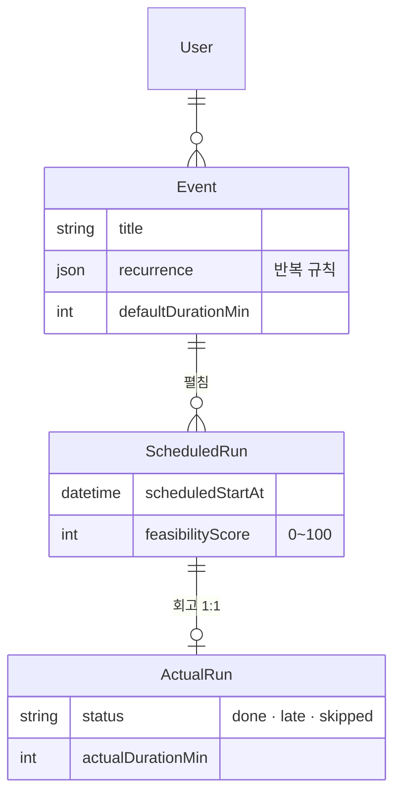

<div align="center">

# Prescient Calendar

"내일 3시에 운동"이라고 치면 일정이 잡히고, "어제 운동 30분 했어"라고 치면 회고가 된다. 기록이 쌓이면 새 일정 옆에 "내가 이 시간대에 보통 지키는 편인지" 점수가 붙는다.

[](https://github.com/foresty110/PrescientCalendar-/actions/workflows/ci.yml) [](https://www.typescriptlang.org/)

**[배포 운영중](https://prescient-calendar.vercel.app)** (Google 계정으로 로그인)

> 로그인 후 우상단 **"테스트 데이터 추가"** 버튼을 누르면 샘플 일정 데이터를 추가해서 기능을 바로 사용해볼 수 있습니다.


</div>

---

## 만든 이유

일정을 잡아두고 안 지키는 게 쌓이면 캘린더는 그냥 소망 목록이 되어버린다. 적는 행위와 실행 사이의 갭을 좁히고 싶었다. 입력도 자연어로, 회고도 자연어로, "이번엔 될까?"라는 질문엔 내 과거 기록으로 답하는 캘린더.

## 기능

**일정 잡기** — 한 줄 채팅으로 단발·반복 일정 모두 처리된다. "매주 화 9시 회의"처럼 반복 조건이 있어도 4주 앞까지 자동으로 펼쳐져 캘린더에 들어간다.

**대화형 회고** — 지나간 일정들을 채팅으로 한꺼번에 정리할 수 있다. "운동은 했는데 독서는 패스"라고 하면 각각 완료·스킵으로 기록된다.

**실현 가능성 점수** — 새 일정을 만들면 비슷한 시간대·요일의 과거 완료율을 합산해 0~100점이 계산된다. 데이터가 부족하면 점수 없이 회색으로 표시.

## 데이터 모델



`Event`(반복 규칙 포함 템플릿)와 `ScheduledRun`(특정 시점 인스턴스)을 분리한 게 핵심. 인스턴스 단위로 회고와 실현 가능성 점수가 1:1 매핑된다.

## 스택

| 영역 | 기술 |
|---|---|
| 프레임워크 | Next.js 15 (App Router), TypeScript strict |
| 스타일 | Tailwind CSS 4 |
| DB | Postgres + Prisma 5 |
| 인증 | Auth.js v5, Google OAuth |
| LLM | Anthropic Claude (tool use, prompt caching) |
| 테스트 | Vitest, Playwright |
| 배포 | Vercel + Neon |

## 로컬 실행

```bash
pnpm install --ignore-scripts
cp .env.example .env    # ANTHROPIC_API_KEY, DATABASE_URL, AUTH_GOOGLE_ID/SECRET 필요
docker compose up -d
pnpm db:migrate
pnpm dev                # http://localhost:3000
```

## 설계 기록

선택의 이유와 막혔던 지점을 따로 남겨뒀다.

- [`docs/decisions/`](docs/decisions/README.md) — 접근법을 비교하고 트레이드오프를 적은 결정들
- [`docs/troubleshooting/`](docs/troubleshooting/README.md) — 증상과 원인이 달랐던 케이스들

---

포트폴리오 목적으로 공개된 저장소입니다. 코드 재사용 시 문의해 주세요.
